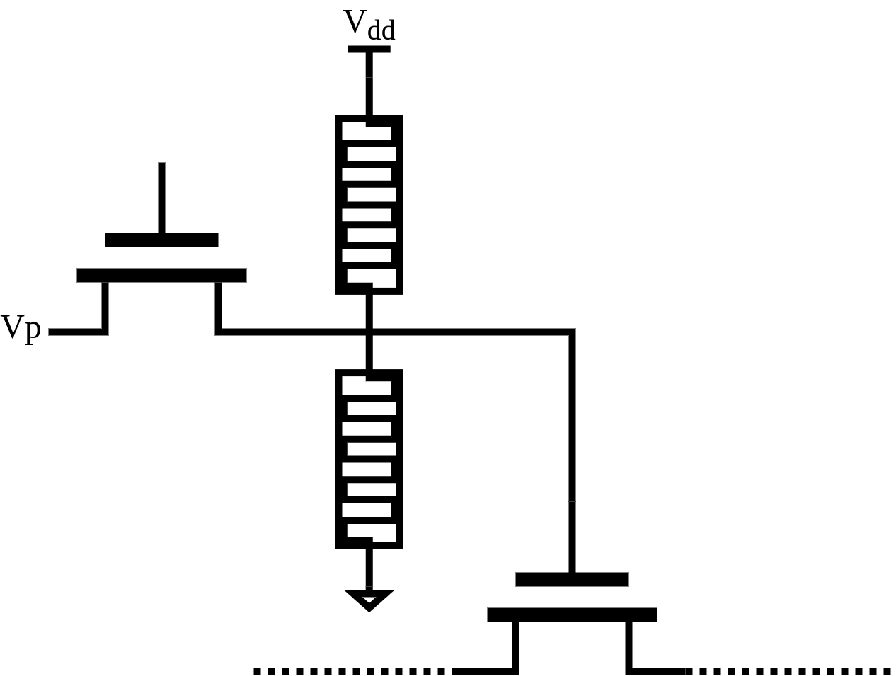
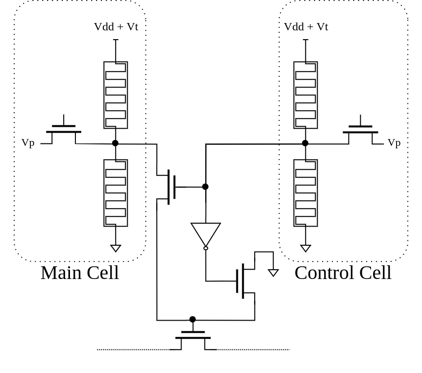

# Fault tolerant routing multiplexer for NV-FPGAS

Exploration and simulation of routing multiplexer architectures for FPGAs with non-volatile (NV) configuration memory.

This work is based on my master thesis at [TU Darmstadt Institute of Computer Systems](https://www.rs.tu-darmstadt.de/). Until its submission there is going to be a lot of WIP in here.

## Introduction

Fault-Tolerant-Routing-Mux (FTRM) simulates two-stage routing multiplexers used in modern FPGA devices, but considers the memory cells controlling the routing switches as memristor-based. It provides 2 types of memristor-based memory cells to be considered: the 2T2R cell and the Proto-Voter cell. By providing a cell type and defect probabilities this module simulates individual memristor defects following the given distributions and its effect on the routing multiplexer.

This module works best in tandem with [Verilog-to-Routing](https://verilogtorouting.org/) and has two operation modes: Standalone simulation or VTR-integrated simulation. An already customized VTR fork is available at [my other repo](https://github.com/gaialucas/vtr-verilog-to-routing). If you intend to use it, please rember to checkout at my branch `gaia/fault_sim`.

## Memory cell types

### 2T2R
FTRM comes packed with the class representations of both the 2T2R and Proto-Voter cells. The 2T2R (shown [below](2T2R-arch)) is the most used design in memristor-based memory cell: 2 memristors act as a voltage divisor for a routing switch and an additional transistor connected to $Vp$ is responsible for programming the divider.

The cell is available for use in FTRM as `FTRM.MemCell`

### Proto-Voter Cell
The Proto-Voter cell ([below](Proto-Voter-arch)) was proposed in my master thesis at TU Darmstadt. It is composed by two 2T2R cells where the control cell decides if the routing switch is driven by the main cell or connected to GND.

The cell is available for use in FTRM as `FTRM.MemCell`

The cell is available for use in FTRM as `FTRM.ProtoVoterCell`

## Standalone Simulation

FTRM main class is called `FaultSimulator`. The standalone simulation can be run by calling its class method `FaultSimulator.standalone_sim()` and providing a defect probability array (`np.array` preferably), the desired memory cell to simulate and the number `n` of devices to generate. The simulation creates `n` 12-input routing multiplexers and simulate memristor defects, returing a report of the amount of defect cells and routing edges.